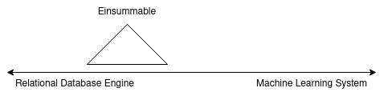
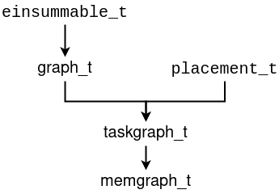

# Einsummable: A Tensor-Relational System for Large Neural Networks

Einsummable is a machine learning (ML) system that automatically distributes
ML compute graphs across clusters of CPU or GPU machines.
While traditional ML systems specify computations by linking together
primitive, high-performance "black-box" operations,
Einsummable is based on the idea that tensors are relations mapping positions
to values and all operations are therefore _relational_.
The benefit of treating ML compute graphs as relational queries is that they can
be easily reasoned and optimized over.

However, classical relational database engines are not fast machine learning systems--
an MKL matrix multiply will be several orders of magnitude faster than the following SQL:
```
SELECT SUM(A.val*B.val)
FROM A, B WHERE A.colID = B.rowID
GROUP BY A.rowID , B.colID
```
Here, matrix tables have schema `rowID | colID | val` where `val` is a scalar.
Full matrix multiply kernels can be used if instead of storing a scalar in `val`,
a sub-tensor is stored:
```
SELECT SUM(matrix_multiply(A.val, B.val))
FROM A, B WHERE A.colID = B.rowID
GROUP BY A.rowID , B.colID
```
A fundamental problem is the size of the sub-tensors. At one extreme, if every table
has one sub-tensor, the SQL code reduces to a single matrix multiply call. At the other
end, if every sub-tensor in a table has one scalar, the SQL code reduces to the
first tables-with-scalars-example.



By operating over relational tensors with sub-tensor values, Einsummable
is really a _hybrid_ tensor-relational system with fast kernel operations over scalars and
relational operations over sub-tensors.

# Overview

ML computations are expressed in the declarative `graph_t` structure; `graph_t` is a
dataflow graph--a directed acyclic graph (DAG) where every edge carries some form of data.
For `graph_t`, every node produces a tensor and edges represent tensors "flowing" from
one node to the next.



While there are several types of nodes in `graph_t`, the core node type is `einsummable_t`.
The `einsummable_t` operation is a generalization of contractions (like matrix multiply),
elementwise ops and reductions. The key idea is that, given an `einsummable_t`, when
tensors are treated like relations with sub-tensor values, the _same_ `einsummable_t`
is formed for kernel operations modulo different sizings.

A `graph_t` object is not intended to be executed directly.
Instead, `graph_t` objects are compiled into `taskgraph_t` objects.
The idea is that (1) while relations are produced from the nodes of `graph_t`,
sub-tensors are produced from nodes of `taskgraph_t` and (2) all computations are site-specific.
More precisely, a `taskgraph_t` is a dataflow graph where edges represent the flow of bytes.
In a `taskgraph_t::apply_t` node, sub-tensors are given to fast kernels
and `taskgraph_t::move_t` sends contiguous blobs of bytes from one site to another.

Given a `graph_t`, there are _a lot_ of equivalent
`taskgraph_t` objects, with vastly different performance characteristics.
Typically, `taskgraph_t` objects are created from
(1) `graph_t` and (2) `placement_t` for every `graph_t` node.
Even though a `taskgraph_t` can be created without a `graph_t`, in practice the following
formula holds: `taskgraph_t = graph_t + list{placement_t}`.
See the [autoplace directory](src/autoplace) for some options on how
to optimally create a list of placements for a given number of machines.

So what is a `placement_t`?

* A `placement_t` is a `partition_t` and a list of sites for every sub-block in that `partition_t`.
* A `partition_t` splits a hyper-rectangular index set into sub-blocks; it is also a list of `partdim_t`.
* A `partdim_t` splits an interval into sub-intervals.


In turn, a `taskgraph_t` is compiled into a `memgraph_t`. Whereas `graph_t` and `taskgraph_t`
are dataflow graphs, `memgraph_t` is not.
Since all tensors have statically known sizes, we can statically compile which memory to use.
That is what memgraphs represent.

# Other Details

For executing memgraphs, see the [engine directory](src/engine).
For seamlessly handling tensors-as-relations and compilations from graph to taskgraph
to memgraph across multiple graph executions, see the [server directory](src/server).
For more easily building graphs, use `graph_writer_t`.


